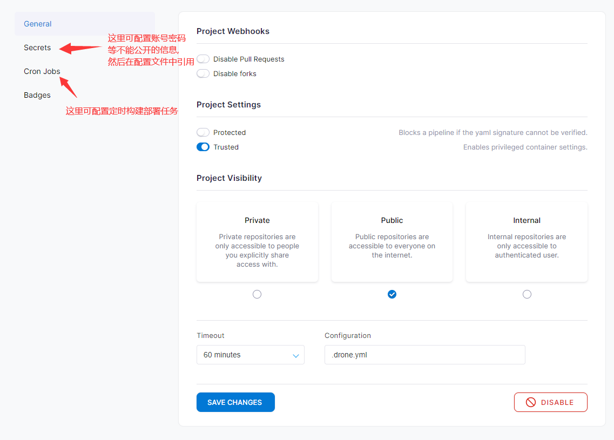
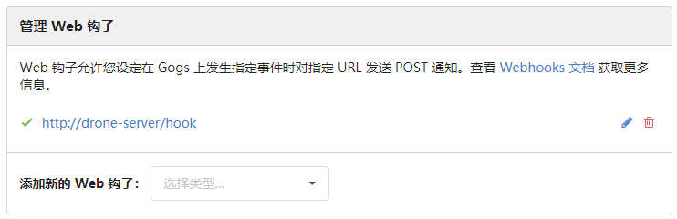
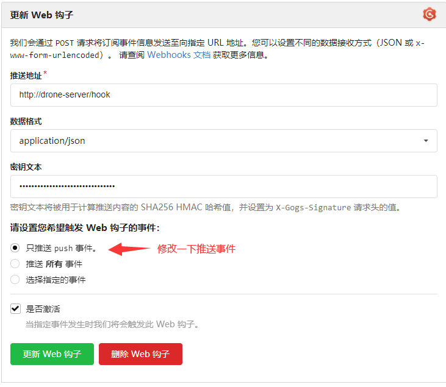
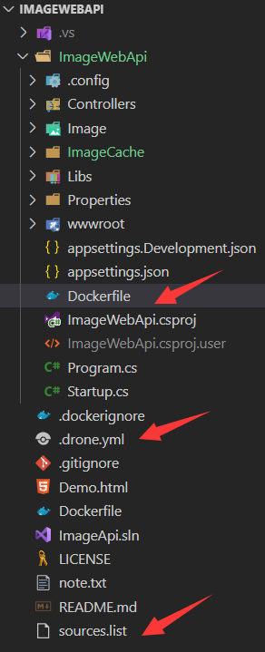
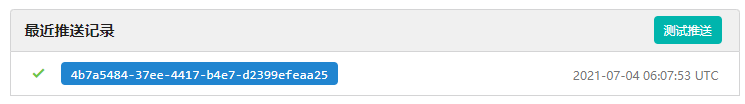
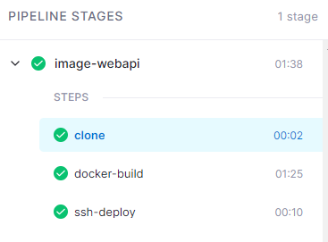
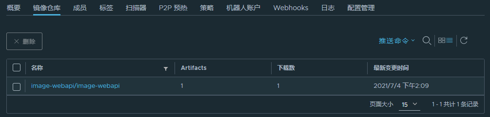
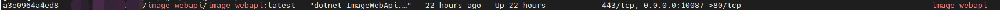

# CICD

本CICD方案基于: Gogs + Drone + Harbor,全docker部署

环境:

- `CentOS Linux release 7.9.2009 (Core)`
- `docker Server Version: 20.10.3`
- `docker-compose version 1.27.2, build 18f557f9`

## 部署Harbor

```sh
mkdir /home/middleware/harbor && cd /home/middleware/harbor
# 下载Harbor
wget https://github.com/goharbor/harbor/releases/download/v2.3.0/harbor-offline-installer-v2.3.0.tgz

# 解压
tar -zxvf harbor-offline-installer-v2.3.0.tgz
cd harbor

# 复制并修改配置模版
cp harbor.yml.tmpl harbor.yml
vi harbor.yml
```

**harbor.yml**

修改如下配置(其余的根据实际需要修改):

- `hostname`, 例如: `10.1.1.1`
- `harbor_admin_password`, 例如: `Harbor12345`
- `database:password`, 例如: `root123`
- `data_volume`, 例如: `/data`

```yaml
# Configuration file of Harbor

# The IP address or hostname to access admin UI and registry service.
# DO NOT use localhost or 127.0.0.1, because Harbor needs to be accessed by external clients.
hostname: 你自己的宿主机ip,可以是外网也可以是内网,也可以是主机名,在使用环境中能够访问到就行

# http related config
http:
  # port for http, default is 80. If https enabled, this port will redirect to https port
  port: 80

# # Uncomment following will enable tls communication between all harbor components
# internal_tls:
#   # set enabled to true means internal tls is enabled
#   enabled: true
#   # put your cert and key files on dir
#   dir: /etc/harbor/tls/internal

# Uncomment external_url if you want to enable external proxy
# And when it enabled the hostname will no longer used
# external_url: https://reg.mydomain.com:8433

# The initial password of Harbor admin
# It only works in first time to install harbor
# Remember Change the admin password from UI after launching Harbor.
harbor_admin_password: Harbor12345

# Harbor DB configuration
database:
  # The password for the root user of Harbor DB. Change this before any production use.
  password: root123
  # The maximum number of connections in the idle connection pool. If it <=0, no idle connections are retained.
  max_idle_conns: 100
  # The maximum number of open connections to the database. If it <= 0, then there is no limit on the number of open connections.
  # Note: the default number of connections is 1024 for postgres of harbor.
  max_open_conns: 900

# The default data volume
data_volume: /data

# Harbor Storage settings by default is using /data dir on local filesystem
# Uncomment storage_service setting If you want to using external storage
# storage_service:
#   # ca_bundle is the path to the custom root ca certificate, which will be injected into the truststore
#   # of registry's and chart repository's containers.  This is usually needed when the user hosts a internal storage with self signed certificate.
#   ca_bundle:

#   # storage backend, default is filesystem, options include filesystem, azure, gcs, s3, swift and oss
#   # for more info about this configuration please refer https://docs.docker.com/registry/configuration/
#   filesystem:
#     maxthreads: 100
#   # set disable to true when you want to disable registry redirect
#   redirect:
#     disabled: false

# Trivy configuration
#
# Trivy DB contains vulnerability information from NVD, Red Hat, and many other upstream vulnerability databases.
# It is downloaded by Trivy from the GitHub release page https://github.com/aquasecurity/trivy-db/releases and cached
# in the local file system. In addition, the database contains the update timestamp so Trivy can detect whether it
# should download a newer version from the Internet or use the cached one. Currently, the database is updated every
# 12 hours and published as a new release to GitHub.
trivy:
  # ignoreUnfixed The flag to display only fixed vulnerabilities
  ignore_unfixed: false
  # skipUpdate The flag to enable or disable Trivy DB downloads from GitHub
  #
  # You might want to enable this flag in test or CI/CD environments to avoid GitHub rate limiting issues.
  # If the flag is enabled you have to download the `trivy-offline.tar.gz` archive manually, extract `trivy.db` and
  # `metadata.json` files and mount them in the `/home/scanner/.cache/trivy/db` path.
  skip_update: false
  #
  # insecure The flag to skip verifying registry certificate
  insecure: false
  # github_token The GitHub access token to download Trivy DB
  #
  # Anonymous downloads from GitHub are subject to the limit of 60 requests per hour. Normally such rate limit is enough
  # for production operations. If, for any reason, it's not enough, you could increase the rate limit to 5000
  # requests per hour by specifying the GitHub access token. For more details on GitHub rate limiting please consult
  # https://developer.github.com/v3/#rate-limiting
  #
  # You can create a GitHub token by following the instructions in
  # https://help.github.com/en/github/authenticating-to-github/creating-a-personal-access-token-for-the-command-line
  #
  # github_token: xxx

jobservice:
  # Maximum number of job workers in job service
  max_job_workers: 10

notification:
  # Maximum retry count for webhook job
  webhook_job_max_retry: 10

chart:
  # Change the value of absolute_url to enabled can enable absolute url in chart
  absolute_url: disabled

# Log configurations
log:
  # options are debug, info, warning, error, fatal
  level: info
  # configs for logs in local storage
  local:
    # Log files are rotated log_rotate_count times before being removed. If count is 0, old versions are removed rather than rotated.
    rotate_count: 50
    # Log files are rotated only if they grow bigger than log_rotate_size bytes. If size is followed by k, the size is assumed to be in kilobytes.
    # If the M is used, the size is in megabytes, and if G is used, the size is in gigabytes. So size 100, size 100k, size 100M and size 100G
    # are all valid.
    rotate_size: 200M
    # The directory on your host that store log
    location: /var/log/harbor

  # Uncomment following lines to enable external syslog endpoint.
  # external_endpoint:
  #   # protocol used to transmit log to external endpoint, options is tcp or udp
  #   protocol: tcp
  #   # The host of external endpoint
  #   host: localhost
  #   # Port of external endpoint
  #   port: 5140

#This attribute is for migrator to detect the version of the .cfg file, DO NOT MODIFY!
_version: 2.3.0

# Uncomment external_database if using external database.
# external_database:
#   harbor:
#     host: harbor_db_host
#     port: harbor_db_port
#     db_name: harbor_db_name
#     username: harbor_db_username
#     password: harbor_db_password
#     ssl_mode: disable
#     max_idle_conns: 2
#     max_open_conns: 0
#   notary_signer:
#     host: notary_signer_db_host
#     port: notary_signer_db_port
#     db_name: notary_signer_db_name
#     username: notary_signer_db_username
#     password: notary_signer_db_password
#     ssl_mode: disable
#   notary_server:
#     host: notary_server_db_host
#     port: notary_server_db_port
#     db_name: notary_server_db_name
#     username: notary_server_db_username
#     password: notary_server_db_password
#     ssl_mode: disable

# Uncomment external_redis if using external Redis server
# external_redis:
#   # support redis, redis+sentinel
#   # host for redis: <host_redis>:<port_redis>
#   # host for redis+sentinel:
#   #  <host_sentinel1>:<port_sentinel1>,<host_sentinel2>:<port_sentinel2>,<host_sentinel3>:<port_sentinel3>
#   host: redis:6379
#   password:
#   # sentinel_master_set must be set to support redis+sentinel
#   #sentinel_master_set:
#   # db_index 0 is for core, it's unchangeable
#   registry_db_index: 1
#   jobservice_db_index: 2
#   chartmuseum_db_index: 3
#   trivy_db_index: 5
#   idle_timeout_seconds: 30

# Uncomment uaa for trusting the certificate of uaa instance that is hosted via self-signed cert.
# uaa:
#   ca_file: /path/to/ca

# Global proxy
# Config http proxy for components, e.g. http://my.proxy.com:3128
# Components doesn't need to connect to each others via http proxy.
# Remove component from `components` array if want disable proxy
# for it. If you want use proxy for replication, MUST enable proxy
# for core and jobservice, and set `http_proxy` and `https_proxy`.
# Add domain to the `no_proxy` field, when you want disable proxy
# for some special registry.
proxy:
  http_proxy:
  https_proxy:
  no_proxy:
  components:
    - core
    - jobservice
    - trivy

# metric:
#   enabled: false
#   port: 9090
#   path: /metrics

```

**初始化和安装**

```sh
# 初始化
./prepare

# 安装
./install.sh
```

*如果安装报错,可以先删除已安装的服务,修改`docker-compose.yml`,在启动服务(为了能够成功,建议无论是否失败都这样处理一下,主要是端口冲突,根据实际情况**修改发布端口和数据卷挂载位置**)*

```sh
# 清除服务并删除挂载的数据卷
docker-compose down -v
```

修改`docker-compose.yml`

```yaml
version: '2.3'
services:
  log:
    image: goharbor/harbor-log:v2.3.0
    container_name: harbor-log
    restart: always
    dns_search: .
    cap_drop:
      - ALL
    cap_add:
      - CHOWN
      - DAC_OVERRIDE
      - SETGID
      - SETUID
    volumes:
      - /var/log/harbor/:/var/log/docker/:z
      - type: bind
        source: ./common/config/log/logrotate.conf
        target: /etc/logrotate.d/logrotate.conf
      - type: bind
        source: ./common/config/log/rsyslog_docker.conf
        target: /etc/rsyslog.d/rsyslog_docker.conf
    ports:
      - 127.0.0.1:1514:10514
    networks:
      - harbor
  registry:
    image: goharbor/registry-photon:v2.3.0
    container_name: registry
    restart: always
    cap_drop:
      - ALL
    cap_add:
      - CHOWN
      - SETGID
      - SETUID
    volumes:
      - /data/registry:/storage:z
      - ./common/config/registry/:/etc/registry/:z
      - type: bind
        source: /data/secret/registry/root.crt
        target: /etc/registry/root.crt
      - type: bind
        source: ./common/config/shared/trust-certificates
        target: /harbor_cust_cert
    networks:
      - harbor
    dns_search: .
    depends_on:
      - log
    logging:
      driver: "syslog"
      options:
        syslog-address: "tcp://localhost:1514"
        tag: "registry"
  registryctl:
    image: goharbor/harbor-registryctl:v2.3.0
    container_name: registryctl
    env_file:
      - ./common/config/registryctl/env
    restart: always
    cap_drop:
      - ALL
    cap_add:
      - CHOWN
      - SETGID
      - SETUID
    volumes:
      - /data/registry:/storage:z
      - ./common/config/registry/:/etc/registry/:z
      - type: bind
        source: ./common/config/registryctl/config.yml
        target: /etc/registryctl/config.yml
      - type: bind
        source: ./common/config/shared/trust-certificates
        target: /harbor_cust_cert
    networks:
      - harbor
    dns_search: .
    depends_on:
      - log
    logging:
      driver: "syslog"
      options:
        syslog-address: "tcp://localhost:1514"
        tag: "registryctl"
  postgresql:
    image: goharbor/harbor-db:v2.3.0
    container_name: harbor-db
    restart: always
    cap_drop:
      - ALL
    cap_add:
      - CHOWN
      - DAC_OVERRIDE
      - SETGID
      - SETUID
    volumes:
      - /data/database:/var/lib/postgresql/data:z
    networks:
      harbor:
    dns_search: .
    env_file:
      - ./common/config/db/env
    depends_on:
      - log
    logging:
      driver: "syslog"
      options:
        syslog-address: "tcp://localhost:1514"
        tag: "postgresql"
    shm_size: '1gb'
  core:
    image: goharbor/harbor-core:v2.3.0
    container_name: harbor-core
    env_file:
      - ./common/config/core/env
    restart: always
    cap_drop:
      - ALL
    cap_add:
      - SETGID
      - SETUID
    volumes:
      - /data/ca_download/:/etc/core/ca/:z
      - /data/:/data/:z
      - ./common/config/core/certificates/:/etc/core/certificates/:z
      - type: bind
        source: ./common/config/core/app.conf
        target: /etc/core/app.conf
      - type: bind
        source: /data/secret/core/private_key.pem
        target: /etc/core/private_key.pem
      - type: bind
        source: /data/secret/keys/secretkey
        target: /etc/core/key
      - type: bind
        source: ./common/config/shared/trust-certificates
        target: /harbor_cust_cert
    networks:
      harbor:
    dns_search: .
    depends_on:
      - log
      - registry
      - redis
      - postgresql
    logging:
      driver: "syslog"
      options:
        syslog-address: "tcp://localhost:1514"
        tag: "core"
  portal:
    image: goharbor/harbor-portal:v2.3.0
    container_name: harbor-portal
    restart: always
    cap_drop:
      - ALL
    cap_add:
      - CHOWN
      - SETGID
      - SETUID
      - NET_BIND_SERVICE
    volumes:
      - type: bind
        source: ./common/config/portal/nginx.conf
        target: /etc/nginx/nginx.conf
    networks:
      - harbor
    dns_search: .
    depends_on:
      - log
    logging:
      driver: "syslog"
      options:
        syslog-address: "tcp://localhost:1514"
        tag: "portal"

  jobservice:
    image: goharbor/harbor-jobservice:v2.3.0
    container_name: harbor-jobservice
    env_file:
      - ./common/config/jobservice/env
    restart: always
    cap_drop:
      - ALL
    cap_add:
      - CHOWN
      - SETGID
      - SETUID
    volumes:
      - /data/job_logs:/var/log/jobs:z
      - type: bind
        source: ./common/config/jobservice/config.yml
        target: /etc/jobservice/config.yml
      - type: bind
        source: ./common/config/shared/trust-certificates
        target: /harbor_cust_cert
    networks:
      - harbor
    dns_search: .
    depends_on:
      - core
    logging:
      driver: "syslog"
      options:
        syslog-address: "tcp://localhost:1514"
        tag: "jobservice"
  redis:
    image: goharbor/redis-photon:v2.3.0
    container_name: redis
    restart: always
    cap_drop:
      - ALL
    cap_add:
      - CHOWN
      - SETGID
      - SETUID
    volumes:
      - /data/redis:/var/lib/redis
    networks:
      harbor:
    dns_search: .
    depends_on:
      - log
    logging:
      driver: "syslog"
      options:
        syslog-address: "tcp://localhost:1514"
        tag: "redis"
  proxy:
    image: goharbor/nginx-photon:v2.3.0
    container_name: nginx
    restart: always
    cap_drop:
      - ALL
    cap_add:
      - CHOWN
      - SETGID
      - SETUID
      - NET_BIND_SERVICE
    volumes:
      - ./common/config/nginx:/etc/nginx:z
      - type: bind
        source: ./common/config/shared/trust-certificates
        target: /harbor_cust_cert
    networks:
      - harbor
    dns_search: .
    ports:
      - 80:8080
    depends_on:
      - registry
      - core
      - portal
      - log
    logging:
      driver: "syslog"
      options:
        syslog-address: "tcp://localhost:1514"
        tag: "proxy"
networks:
  harbor:
    external: false
```

**启动服务**

```
docker-compose up -d
```

## 使用Harbor

### 配置Harbor

**登录Harbor**

> http://<宿主机ip>:80
> admin
> Harbor12345

**新增用户**

> 地址: /harbor/users
> 用户名: jack
> 邮箱: wangyihu2009@yeah.net
> 全名: jack_wang
> 密码: jack123
> 注释: 仓库操作员

**新增项目**

> 地址: /harbor/projects
> 项目名称: image-webapi
> 访问级别: 私有
> 存储容量: 无限制
> 镜像代理: 无

**为项目增加用户**

> 地址: /harbor/projects/n/members, 其中`n`为项目ID
> 用户名称: jack(上面添加的用户)
> 角色: 维护人员

### 上传下载镜像

修改`daemon.json`

```sh
# 添加insecure-registries配置,否则在推送或登录时会报错
vi /etc/docker/daemon.json

# 新增如下配置
"insecure-registries":["仓库外部访问ip或主机名:仓库服务端口"]
# 例如
"insecure-registries":["10.0.0.1:8080"]
```

**重启docker服务**

```sh
systemctl daemon-reload
systemctl restart docker
systemctl status docker.service
```

**登录镜像仓库**

```sh
docker login 仓库外部访问ip或主机名:仓库服务端口
# 账号: jack
# 密码: jack123

# 登录后,登录信息会缓存到~/.docker/config.json文件中
```

**推送镜像**

```sh
# 必须先给镜像更改标签，并推送
# 在项目中标记镜像
docker tag image-webapi:latest 仓库外部访问ip或主机名:仓库服务端口/image-webapi/image-webapi:latest

# 将镜像推送到仓库
docker push 仓库外部访问ip或主机名:仓库服务端口/image-webapi/image-webapi:latest
```

**删除本地镜像,并从镜像仓库拉取**

```sh
docker rmi 仓库外部访问ip或主机名:仓库服务端口/image-webapi/image-webapi:latest image-webapi:latest

docker pull 仓库外部访问ip或主机名:仓库服务端口/image-webapi/image-webapi:latest
```

**登出镜像仓库**

```sh
docker logout 仓库外部访问ip或主机名:仓库服务端口
```

## 部署Gogs + Drone

**准备环境**

```sh
mkdir -p /home/drone && cd /home/drone

vi docker-compose.yml
```

**docker-compose.yml**

```yaml
version: '3'
services:
  drone-server:
    image: drone/drone:latest
    restart: always
    privileged: true
    ports:
      - "8080:80"
      - 8843:443
      - 9000
    volumes:
      - ./drone/drone:/var/lib/drone/
      - ./drone/data:/data/
      - /var/run/docker.sock:/var/run/docker.sock
    environment:
      - DRONE_OPEN=true
      - DRONE_DEBUG=true
      - DRONE_LOGS_TRACE=true
      - DRONE_LOGS_DEBUG=true
      - DRONE_LOGS_PRETTY=true
      - DRONE_AGENTS_ENABLED=true
      - DRONE_SERVER_HOST=drone-server
      - DRONE_GIT_ALWAYS_AUTH=false
      - DRONE_GOGS=true
      - DRONE_GOGS_SKIP_VERIFY=false
      - DRONE_GOGS_PRIVATE_MODE=true
      - DRONE_GOGS_SERVER=http://gogs:3000
      - DRONE_PROVIDER=gogs
      - DRONE_DATABASE_DATASOURCE=/var/lib/drone/drone.sqlite
      - DRONE_DATABASE_DRIVER=sqlite3
      - DRONE_SERVER_PROTO=http
      - DRONE_RPC_SECRET=ALQU2M0KdptXUdTPKcEw
      - DRONE_SECRET=ALQU2M0KdptXUdTPKcEw
      - DRONE_USER_CREATE=username:jack,admin:true
      - TZ=Asia/Shanghai
  
  drone-runner-docker:
    image: drone/drone-runner-docker:latest
    restart: always
    privileged: true
    depends_on:
      - drone-server
    volumes:
      - /var/run/docker.sock:/var/run/docker.sock
    ports:
      - "10083:3000"
    environment:
      - DRONE_RPC_PROTO=http
      - DRONE_RPC_HOST=drone-server:80
      - DRONE_RPC_SECRET=ALQU2M0KdptXUdTPKcEw
      - DRONE_RUNNER_CAPACITY=2
      - DRONE_RUNNER_NAME=drone-runner-docker
      - DRONE_DEBUG=true
      - DRONE_LOGS_TRACE=true
      - DRONE_LOGS_DEBUG=true
      - DRONE_LOGS_PRETTY=true
      - DRONE_UI_USERNAME=root
      - DRONE_UI_PASSWORD=root
      - TZ=Asia/Shanghai
  
  drone-runner-ssh:
    image: drone/drone-runner-ssh:latest
    restart: always
    privileged: true
    depends_on:
      - drone-server
    volumes:
      - /var/run/docker.sock:/var/run/docker.sock
    ports:
      - "10084:3000"
    environment:
      - DRONE_RPC_PROTO=http
      - DRONE_RPC_HOST=drone-server:80
      - DRONE_RPC_SECRET=ALQU2M0KdptXUdTPKcEw
      - DRONE_RUNNER_CAPACITY=2
      - DRONE_RUNNER_NAME=drone-runner-ssh
      - DRONE_DEBUG=true
      - DRONE_LOGS_TRACE=true
      - DRONE_LOGS_DEBUG=true
      - DRONE_LOGS_PRETTY=true
      - DRONE_UI_USERNAME=root
      - DRONE_UI_PASSWORD=root
      - TZ=Asia/Shanghai
  
  gogs:
    image: gogs/gogs:latest
    restart: always
    privileged: true
    ports:
      - "10022:22"
      - "3000:3000"
    volumes:
      - ./gogs/data:/data
    depends_on:
      - mysql

  mysql:
    image: mysql:5.7.16
    restart: always
    privileged: true
    volumes:
      - ./gogs/mysql:/var/lib/mysql
      - /var/run/docker.sock:/var/run/docker.sock
    ports:
      - 3308:3306
    command: --character-set-server=utf8mb4 --collation-server=utf8mb4_unicode_ci
    environment:
      MYSQL_ROOT_PASSWORD: pass
      MYSQL_DATABASE: gogs
      MYSQL_USER: gogs
      MYSQL_PASSWORD: pass
      TZ: Asia/Shanghai
  
  drone-agent:
    image: drone/agent:latest
    restart: always
    privileged: true
    depends_on:
      - drone-server
    volumes:
      - /var/run/docker.sock:/var/run/docker.sock
    environment:
      - DRONE_RPC_SERVER=http://drone-server
      - DRONE_RPC_SECRET=ALQU2M0KdptXUdTPKcEw
      - DRONE_DEBUG=true
      - DRONE_SERVER=drone-server:9000
      - DRONE_SECRET=ALQU2M0KdptXUdTPKcEw
```

**启动服务**

```sh
docker-compose up -d
```

## 初始化Gogs

```
地址: http://宿主机ip或主机名:3000/install

数据库设置
数据库类型: MySQL
数据库主机: mysql:3306
数据库用户: gogs
数据库用户密码: pass
数据库名称: gogs

应用基本设置
应用名称: Gogs
仓库根目录: /data/git/gogs-repositories
运行系统用户: git
域名: 宿主机ip或主机名
SSH 端口号: 10022
HTTP 端口号: 3000
应用 URL: http://宿主机ip或主机名:3000/
日志路径: /app/gogs/log
启用控制台模式: 勾选

邮箱服务设置
不配置

服务器和其它服务设置
启用离线模式: 勾选
禁用 Gravatar 服务: 勾选
启用 Federated Avatars 查找: 不勾选
禁止用户自主注册: 勾选
启用验证码服务: 不勾选
启用登录访问限制: 不勾选

管理员帐号设置
管理员用户名: jack
管理员密码: jack123
管理员邮箱: wangyihu2009@yeah.net
```

**创建代码仓库**

```
仓库名称: ImageWebApi
```

## 配置Drone

```
地址: http://宿主机ip或主机名:8080

使用gogs的账号登录
账号: jack
密码: jack123
邮箱: wangyihu2009@yeah.net
全名: jack_wang
公司: jack_company
```

**激活仓库**

```
1. 如果在 REPOSITORIES 列表中没有看到 jack/ImageWebApi 项目,点击右上角 SYNC 按钮,等待同步完成

2. 点击 jack/ImageWebApi 项进入,选择 Settings Tab, 点击 Activate Repository 按钮(此时会在gogs对应的仓库中生成一个 webhook), 将 Project Settings 中的 Trusted 勾选上, Project Visibility 选择 public, 点击 Save Changes 按钮保存
```



在gogs中可以看到自动生成了一个webhook

地址: /jack/ImageWebApi/settings/hooks



点击webhook,更新一下配置



## 提交项目到gogs,自动触发CICD

### 准备本地配置

- 从github上下载项目

  - > 地址: https://github.com/jieke-wang/ImageWebApi.git

- 项目下载完成后,删除`.git`目录

- 在项目根目录下创建 `.drone.yml`(drone的配置文件)

  ```yaml
  kind: pipeline
  type: docker
  name: image-webapi
  platform:
    os: linux
    arch: amd64
  
  steps:
  
    - name: docker-build
      image: plugins/docker
      settings: 
        username: harbor账号
        password: harbor密码
        repo: gogs服务ip或域名:gogs服务端口/image-webapi/image-webapi
        registry: http://harbor服务ip或域名:harbor服务端口
        insecure: true
        privileged: true
        dockerfile: ./ImageWebApi/Dockerfile
        tags:
          - 'latest'
  
    - name: ssh-deploy
      image: appleboy/drone-ssh
      settings:
        insecure: true
        privileged: true
        host: 目标部署服务器ip或主机名
        port: 目标服务器的ssh端口
        username: 目标服务器用户名
        password: 目标服务器密码
        command_timeout: 3m
        script:
          - echo "harbor密码" | docker login -u harbor账号 --password-stdin harbor服务ip或主机名:harbor服务端口
          - docker pull harbor服务ip或主机名:harbor服务端口/image-webapi/image-webapi:latest
          - docker stop image-webapi || true
          - docker rm image-webapi || true
          - docker run -d --name image-webapi -p 10087:80 -v /home/app/image-webapi/Image:/app/Image -v /home/app/image-webapi/ImageCache:/app/ImageCache harbor服务ip或主机名:harbor服务端口/image-webapi/image-webapi:latest
  
  trigger:
    branch:
      - main
    event:
      - push
  ```

- 在项目根目录下创建`sources.list`,用于docker file中修改镜像源

  ```
  deb http://mirrors.ustc.edu.cn/debian/ stretch main non-free contrib
  deb http://mirrors.ustc.edu.cn/debian/ stretch-updates main non-free contrib
  deb http://mirrors.ustc.edu.cn/debian/ stretch-backports main non-free contrib
  deb-src http://mirrors.ustc.edu.cn/debian/ stretch main non-free contrib
  deb-src http://mirrors.ustc.edu.cn/debian/ stretch-updates main non-free contrib
  deb-src http://mirrors.ustc.edu.cn/debian/ stretch-backports main non-free contrib
  deb http://mirrors.ustc.edu.cn/debian-security/ stretch/updates main non-free contrib
  deb-src http://mirrors.ustc.edu.cn/debian-security/ stretch/updates main non-free contrib
  ```

- 在`ImageWebApi`下创建`Dockerfile`文件

  ```dockerfile
  #See https://aka.ms/containerfastmode to understand how Visual Studio uses this Dockerfile to build your images for faster debugging.
  
  FROM mcr.microsoft.com/dotnet/aspnet:5.0-buster-slim AS base
  ADD sources.list /etc/apt/
  RUN apt-get update -y && apt-get install -y libgdiplus && apt-get clean && ln -s /usr/lib/libgdiplus.so /usr/lib/gdiplus.dll
  WORKDIR /app
  EXPOSE 80
  EXPOSE 443
  
  FROM mcr.microsoft.com/dotnet/sdk:5.0-buster-slim AS build
  WORKDIR /src
  COPY ["ImageWebApi/ImageWebApi.csproj", "ImageWebApi/"]
  RUN dotnet restore "ImageWebApi/ImageWebApi.csproj"
  COPY . .
  WORKDIR "/src/ImageWebApi"
  RUN dotnet build "ImageWebApi.csproj" -c Release -o /app/build
  
  FROM build AS publish
  RUN dotnet publish "ImageWebApi.csproj" -c Release -o /app/publish
  
  FROM base AS final
  WORKDIR /app
  COPY --from=publish /app/publish .
  ENTRYPOINT ["dotnet", "ImageWebApi.dll"]
  ```

- 配置文件位置
  

### 准备目标服务器的挂载

```sh
mkdir -p /home/app/image-webapi && cd /home/app/image-webapi && mkdir ImageCache

# 将 ImageWebApi/Image拷贝到 /home/app/image-webapi目录下
```

### 将代码上传到gogs

```
git init
git add .
git commit -a -m "first commit"
git branch -M main
git remote add origin https://github.com/jieke-wang/FastDFSSample.git
git push -u origin main
```

- 代码推送完毕,即可在gogs的Webhook中看到推送记录

  地址: /jack/ImageWebApi/settings/hooks/2



- 在drone中查看pipeline的执行
  地址: /jack/ImageWebApi/1
  

- 待drone执行完毕,可以在harbor中查看上传的镜像
  地址: /harbor/projects/3/repositories
  

- 在目标部署服务器中查看拉取的镜像及创建的容器
  `docker image ls | grep image-webapi`
  
  `docker ps | grep image-webapi`
  

